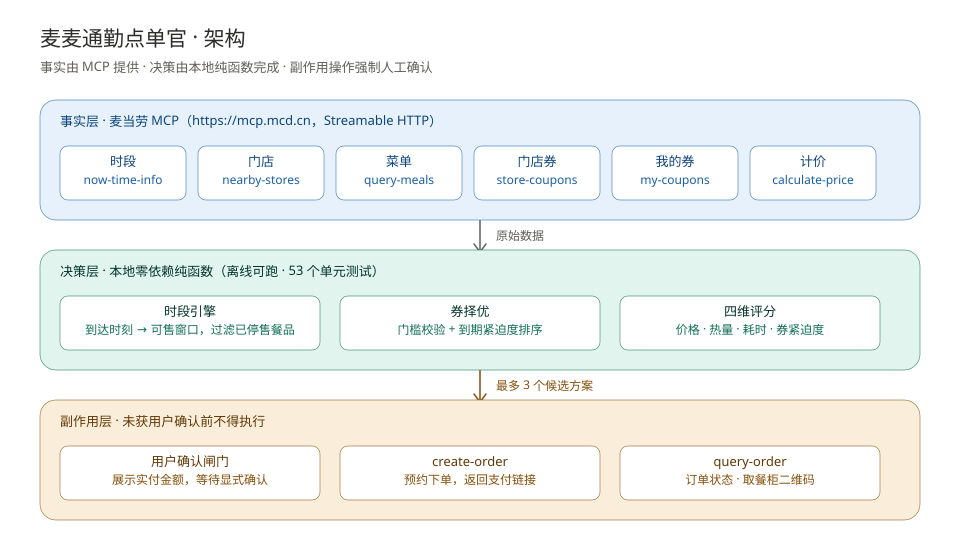

# 麦麦通勤点单官 · mcd-commute-butler

> 通勤路上说一句「8:20 出发，9 点到公司，预算 20，想喝咖啡」——
> 它算出你**到达时还能买到什么**、**顺路哪家店最合适**、**哪张券快过期该先用**，
> 给出三个候选方案，确认后直接预约下单。

**供餐时段是一个时钟，券的有效期是另一个时钟。本项目只做一件事：把两个时钟对齐。**

基于 [麦当劳 MCP Server](https://github.com/M-China/mcd-mcp-server) 构建的 WorkBuddy Skill。
麦当劳程序员创意开发大赛参赛作品。

## 为什么是「两个时钟」

点单这件事上有两个独立运行、且都会归零的倒计时：

| 时钟 | 归零后果 | 谁在看 |
|---|---|---|
| **供餐时段**（早餐通常 10:30 结束） | 到了发现买不到，白跑一趟 | 用户 |
| **券的有效期**（一张券一条倒计时） | 到期作废，优惠直接损失 | 几乎没人看 |

市面上的同类工具通常只盯一个：省钱类工具盯着「哪张券折扣大」，却不管你到店时还能不能买；
时间类工具盯着「几点能拿到」，却不管你手里那张满 20 减 12 明天就要作废。

**两个时钟的交叉点，才是通勤点单真正的决策位置。** 本项目就收在这个点上。

## 与同类方案的差异

| 维度 | 省钱类工具 | 时间类工具 | **本项目** |
|---|---|---|---|
| 决策起点 | 哪张券折扣最大 | 几点能拿到 | **到达时刻 ∩ 券到期时刻** |
| 供餐时段 | 不考虑 | 考虑 | 考虑，并据此**过滤不可售餐品** |
| 券的角色 | 优化目标 | 通常不考虑 | **会折旧的资产**，单独一维评分 |
| 渠道切换 | 不考虑 | 按总耗时切换 | 按配送费摊薄效果切换 |
| 输出 | 推荐清单 | 直接下单 | 最多 3 个互不相同的方案 + 强制确认 |

我们**不**把券当作纯粹的省钱手段，而是当作**有时间价值的资产**来调度 ——
这是「券到期紧迫度」被单列为一个评分轴（权重 0.25）的原因。

---

## 架构



三层分离，边界刻意做硬：

| 层 | 职责 | 组件 | 是否持凭据 |
|---|---|---|---|
| **事实层** | 门店、菜单、券、计价、订单 | 麦当劳 MCP | 是（仅此层） |
| **决策层** | 时段判定、券择优、四维评分、渠道取舍 | `scripts/*.mjs`（零依赖纯函数） | **否** |
| **副作用层** | 创建订单、一键领券、积分兑换 | 麦当劳 MCP | 是，且**强制人工确认** |

这么分的三个直接好处：

1. **决策层可离线验证** —— 拿不到 Token 也能跑 `--demo` 和全部单元测试。
2. **决策层不持凭据** —— 从架构上就无法绕过用户确认去下单，而不是靠约定。
3. **算法可测试** —— 时段和券算错会直接让用户"白跑一趟"或"少省一笔"，必须锁死。

## 为什么需要它

大多数点单助手回答的是「有什么可买」。但通勤场景真正的约束是**时间**：

| 真实痛点 | 一般的助手 | 本项目 |
|---|---|---|
| 09:55 出发，40 分钟车程，到店时早餐刚好停售 | 到了才发现买不到 | 出发前就算出「到达时早餐只剩 5 分钟」，**立刻预约下单** |
| 手里有 5 张券，明天到期那张是满 20 减 12 | 只说「你有这些券」 | 按到期紧迫度排序，**主动把快过期的券安排进方案** |
| 早高峰取餐排队 15 分钟，迟到 | 不考虑出餐时间 | 把「取餐耗时」作为独立评分轴，权重与价格同级 |
| 暴雨天还想出门取餐 | 照常推荐到店 | 自动建议切换为麦乐送，重算配送费与可用券 |

一句话概括：**它把「现在几点」翻译成「还能买什么」，把「优惠券」当作会折旧的资产来管理。**

## 目标用户

- 早高峰通勤、习惯在上班路上解决早餐的上班族
- 手里积压多张即将过期优惠券的麦当劳会员
- 需要为团队/家人批量安排餐食、且对时间窗口敏感的用户
- 在做「AI Agent 编排真实商业 API」实践的开发者

## 快速开始

### 1. 申请 MCP Token

前往 <https://open.mcd.cn/mcp>，用手机号登录 → 控制台 → 激活 → 复制 Token。

### 2. 配置连接器

在 WorkBuddy 的【专家·技能·连接器】→【连接器】→【自定义连接器】→【配置 MCP】中填入：

```json
{
  "mcpServers": {
    "mcd-mcp": {
      "type": "streamablehttp",
      "url": "https://mcp.mcd.cn",
      "headers": {
        "Authorization": "Bearer YOUR_MCP_TOKEN"
      }
    }
  }
}
```

把 `YOUR_MCP_TOKEN` 替换为实际 Token 后保存并启用。
（脱敏示例见 [`mcp-config.example.json`](./mcp-config.example.json)）

### 3. 使用

直接在对话里说需求即可，例如：

```
我 8:20 出门，9:00 到公司，预算 20，想喝咖啡
```

Skill 会自动调用 MCP 拉取门店、菜单与优惠券，输出候选方案，确认后才下单。

### 4. 验证连接（可选，但推荐）

带 Token 跑一次连通性自检，确认 MCP 可达且工具可用：

```bash
MCD_MCP_TOKEN=你的Token node scripts/mcp-smoke.mjs
```

输出会依序列出 `initialize` → `notifications/initialized` → `tools/list` 的结果，
并真实调用一次 `now-time-info`。Token 只从环境变量读取，不落盘、不打印。

## 使用示例

> **关于示例数据**：以下输出均由仓库内脚本**真实运行**产生，输入为 `examples/payload-*.json`
> 或内置演示数据，用于验证决策逻辑本身。接入真实 MCP Token 后，门店、菜单、优惠券与价格
> 由麦当劳 MCP 实时返回，**决策层逻辑完全一致**。

### 示例一 · 早八通勤抢早餐

**输入**

```
我 8:20 出门，40 分钟到公司，预算 40，想喝咖啡
```

**输出**（`scripts/plan-commute-order.mjs` 真实运行输出 · 输入为内置演示数据）

```
=== 麦麦通勤点单官 · 通勤点单方案 ===
出发时间  2026-10-10 08:20
预计到达  2026-10-10 09:00
到达时段  早餐（供应 05:00–10:30，到达后剩余 90 分钟）
目标门店  世纪大道店（距目的地约 260 米）

提示：
  · 按到达时间 2026-10-10 09:00（早餐时段）过滤掉 1 个当前不可售餐品。

候选方案（3 个）：
  [1] ★ 推荐　评分 81　[最省 · 最低热量 · 最快取餐]
      组合：美式咖啡
      金额：原价 ¥12.00 − 优惠 ¥3.00 = 应付 ¥9.00
      热量：10 kcal　预计取餐：约 6 分钟
      用券：饮品立减3元（有效期充裕，剩余 10.7 天）

  [2] 评分 72　[最快取餐]
      组合：香浓拿铁
      金额：原价 ¥15.00 − 优惠 ¥3.00 = 应付 ¥12.00
      热量：130 kcal　预计取餐：约 6 分钟

  [3] 评分 57.5　[均衡]
      组合：早安咖啡组合
      金额：原价 ¥22.00 − 优惠 ¥12.00 = 应付 ¥10.00
      热量：380 kcal　预计取餐：约 8 分钟
      用券：通勤专享 满20减12（3 天内到期，剩余 1.7 天）  ← 主动用掉快过期的券

推荐：方案 1（评分 81）
下单前请确认方案与支付金额 —— 本工具不会自动扣款。
```

### 示例二 · 券到期救援

```
node scripts/coupon-deadline-rescue.mjs --demo
```

输出按到期紧迫度分档的核销优先级清单，并标注「抵扣额相对门槛偏低，不建议为用券而凑单」这类提醒。

### 示例三 · 临界时段（到达即停售）

见 [`examples/demo-3-boundary.md`](./examples/demo-3-boundary.md)。

## 渠道决策：自取还是外送

先说清楚一件事，免得误解：**在同一门店、同一菜单、同一张券的前提下，外送必然比自取贵，差额恰好等于配送费。**

所以「渠道决策」的实质不是比价，而是把 **「用多少钱换不用出门」** 这笔账算清楚。

```bash
node scripts/plan-commute-order.mjs --input examples/payload-delivery.json --advise-channel
```

```
=== 麦麦通勤点单官 · 渠道决策 ===

建议渠道：到店自取

  理由：同为 ¥11.00 的自取方案，外送需多付 ¥9.00 配送费（+30 分钟），自取更省。

  对比（取各自最优方案）：
    自取　实付 ¥11.00　耗时约 6 分钟　玉米杯 + 美式咖啡
    外送　实付 ¥20.00　耗时约 36 分钟　玉米杯 + 美式咖啡
    → 选外送需多付 ¥9.00（含配送费 ¥9.00），耗时差 +30 分钟

渠道建议只说明取舍，最终选择请由用户决定。
```

判定顺序（前一条优先命中）：

| 顺序 | 条件 | 建议 | 依据 |
|---|---|---|---|
| 1 | 用户说明无法出门 | 外送 | 便利性压倒成本 |
| 2 | 到达时距时段结束 < 30 分钟 | 自取 | 外送时效不可控，容易错过窗口 |
| 3 | 配送费占预算 > 20% | 自取 | 配送费吃掉的预算比例过高 |
| 4 | 其余情况 | 自取 | 同菜单下外送必然更贵，差额 = 配送费 |

**注意第 4 条的含义**：如果不考虑便利性，本工具永远推荐自取 —— 因为那是数学结论。
它不假装存在"外送更便宜"的可能，而是把溢价和耗时差**明确列出来**让用户判断。

## 无需 Token 也能试

两个脚本都是**零依赖纯计算模块**，不发起任何网络请求，可以直接跑内置演示：

```bash
node scripts/plan-commute-order.mjs --demo          # 通勤方案
node scripts/coupon-deadline-rescue.mjs --demo      # 券到期救援
node scripts/plan-commute-order.mjs --demo --json   # 机器可读输出
```

## 测试

**53 个单元测试，零依赖，离线可跑**，覆盖时段引擎、到达时间推算、券择优、四维评分与渠道决策五组核心逻辑：

```bash
npm test
# 或
node --test tests/plan-commute-order.test.mjs
```

测试重点覆盖容易出错的时间边界：

- 时区偏移解析不依赖运行机器时区（`+08:00` 与 `Z` 表示同一时刻）
- 时段边界左闭右开（`10:30` 属正餐，`10:29` 属早餐）
- 夜宵时段跨零点的剩余分钟计算
- 到达时间跨零点进位
- 券门槛的边界值（`19.9` 不触发满 20 减 12，`20` 触发）
- 折扣率加封顶的取小逻辑
- 应付相同时优先选用更早到期的券
- 预算与热量上限被严格执行，不因评分而放宽
- 外送场景计入配送费、到店场景不计入
- 渠道决策的四条判定优先级，以及「选外送溢价 = 配送费」这一恒等式

时段与券的逻辑一旦算错，「到达时买不到」或「少省一笔」都会直接损害用户，
所以这部分不靠人工抽查，全部用测试锁住。

## 它是怎么工作的

```
用户输入（出发时间 / 通勤时长 / 目的地 / 预算 / 口味）
        │
        ├── now-time-info ────────→ 判定到达时段与剩余分钟
        ├── query-nearby-stores ──→ 顺路门店
        ├── query-meals ──────────→ 实时可售菜单
        └── query-my-coupons ─────→ 券池
        │
        ▼
   ┌─────────────────────────────────────┐
   │  scripts/plan-commute-order.mjs     │
   │  ① 按到达时段过滤不可售餐品          │
   │  ② 按预算 / 热量 / 偏好过滤          │
   │  ③ 枚举单品与跨品类组合              │
   │  ④ 为每个组合挑「应付最低」的券      │
   │  ⑤ 四维加权评分                      │
   └─────────────────────────────────────┘
        │
        ▼
   最多 3 个互不相同的方案（标注最省 / 最低热量 / 最快取餐）
        │
        ▼
   ⚠ 用户确认闸门（未确认绝不下单）
        │
        ▼
   create-order → 支付链接 / 取餐柜二维码
```

### 四维评分模型

| 维度 | 权重 | 尺度 |
|---|---|---|
| 价格（实际应付） | 0.35 | 候选集内 min-max 归一化 |
| 热量 | 0.10 | 候选集内 min-max 归一化 |
| 取餐耗时 | 0.30 | 候选集内 min-max 归一化 |
| **券到期紧迫度** | **0.25** | 绝对尺度：`1 − 剩余天数 / 14` |

前三维用相对位置衡量，第四维用绝对尺度 —— 因为**把即将过期的券用掉本身就是收益**，
不应该因为它"在这批候选里不算最便宜"而被忽略。没有可用券的方案在该轴得 0 分。

评分权重可通过输入中的 `weights` 字段覆盖。

## 输入结构

`plan-commute-order.mjs` 的输入是一个 JSON 对象。除 `departTime` 与 `travelMinutes` 外均可省略。

```json
{
  "now": "2026-10-10T08:15:00+08:00",
  "departTime": "2026-10-10T08:20:00+08:00",
  "travelMinutes": 40,
  "budget": 40,
  "maxCalories": 600,
  "preference": "咖啡",
  "fulfillment": "pickup",
  "queueBaseMinutes": 4,
  "weights": {
    "price": 0.35,
    "calories": 0.1,
    "wait": 0.3,
    "expiry": 0.25
  },
  "stores": [
    {
      "storeCode": "SH-PD-001",
      "name": "世纪大道店",
      "distanceMeters": 260,
      "open": true
    }
  ],
  "meals": [
    {
      "code": "M001",
      "name": "香浓拿铁",
      "category": "饮品",
      "price": 15,
      "calories": 130,
      "prepMinutes": 2,
      "tags": ["咖啡", "热饮"],
      "windows": ["breakfast", "lunch", "afternoon"]
    }
  ],
  "coupons": [
    {
      "couponId": "C-001",
      "title": "通勤专享 满20减12",
      "discount": 12,
      "minSpend": 20,
      "expireAt": "2026-10-11T23:59:00+08:00"
    }
  ]
}
```

字段说明：

| 字段 | 说明 |
|---|---|
| `departTime` | 出发时间，ISO 8601 带时区偏移 |
| `travelMinutes` | 通勤时长（分钟） |
| `meals[].windows` | 该餐品可售的时段；省略表示全时段可售 |
| `meals[].prepMinutes` | 出餐耗时；实际取餐耗时 = `queueBaseMinutes` + 该值 |
| `coupons[].discount` | 固定抵扣额；也可改用 `discountRate` + `discountCap` 表示折扣 |
| `weights` | 覆盖默认评分权重 |

## 项目结构

```
mcd-commute-butler/
├── SKILL.md                          # WorkBuddy Skill 主体（编排逻辑与硬约束）
├── README.md                         # 本文件
├── MCP_INTEGRATION.md                # MCP Tool 使用说明与业务价值
├── mcp-config.example.json           # 脱敏配置示例
├── CONTEST_DECLARATION.md            # 参赛声明（活动方提供，内容不可改动）
├── workbuddy.md                      # WorkBuddy 开发对话上下文
├── reference/
│   ├── time-window-rules.md          # 供应时段规则与临界点处理
│   ├── tool-playbook.md              # 各场景 Tool 调用序列
│   └── edge-cases.md                 # 异常与降级策略
├── scripts/
│   ├── plan-commute-order.mjs        # 通勤方案计算引擎 + 渠道决策（零依赖）
│   ├── coupon-deadline-rescue.mjs    # 券与积分到期分档
│   └── mcp-smoke.mjs                 # MCP 连通性自检（需 Token）
├── tests/
│   └── plan-commute-order.test.mjs   # 53 个单元测试
├── assets/
│   └── architecture.svg              # 架构图
└── examples/
    ├── demo-1-morning-commute.md
    ├── demo-2-rainy-day-delivery.md
    └── demo-3-boundary.md
```

## 设计边界

本项目刻意**不做**以下事情：

- **不自动下单。** 任何订单都必须经过用户显式确认，不存在"静默下单"路径。
- **不做品牌对比。** 不提及、不比较任何其他餐饮品牌。
- **不给医疗或营养建议。** 热量仅作为筛选参数展示。
- **不编造数据。** 餐品、价格、券、门店全部以 MCP 返回结果为准；拿不到就如实说明。
- **不外泄凭据。** Token 只从环境变量读取，任何输出中都不包含 Token 原文。

## 常见问题

**Q：需要麦当劳账号吗？**
需要。MCP Token 要用手机号登录申请，订单会创建在你自己的账号下。

**Q：会自己帮我付钱吗？**
不会。下单只创建订单并返回支付链接，支付动作由你自己完成。

**Q：门店供应时间和我这里不一样？**
时段表只是「估算器」，真正的可售性以门店实时菜单为准。两者冲突时以门店为准，见 `reference/time-window-rules.md`。

**Q：没有 Token 能跑吗？**
能。两个脚本都是纯计算模块，`--demo` 可直接运行。

## 免责声明

本项目为麦当劳程序员创意开发大赛参赛作品，由参赛者独立开发，**非麦当劳官方产品**。
项目输出仅供参考，不构成医疗、营养或其他专业建议；餐品信息、价格及供应状态以麦当劳官方渠道的实时结果为准。

## 参与贡献

欢迎提交 Issue 反馈场景与边界情况。如果这个 Skill 对你有帮助，**欢迎 Star ⭐** —— 这是对独立开发者最直接的支持。
